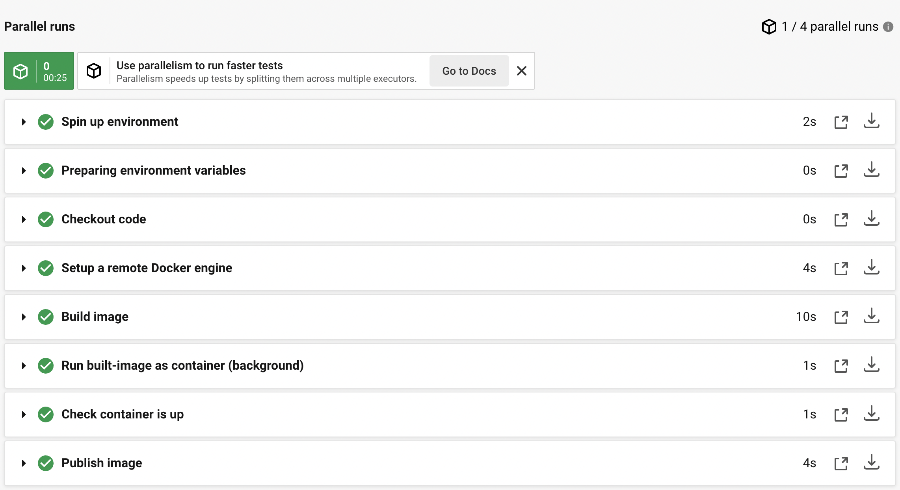
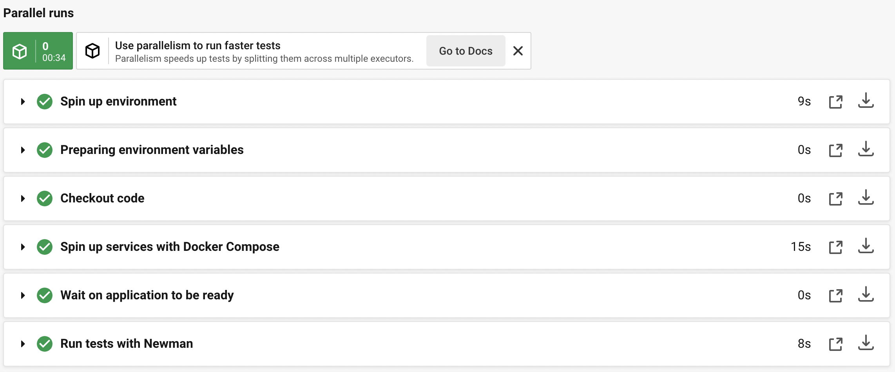

  
   
  <h1>Whale of a Time!</h1>

This repository explores all the typical Docker-related operations within CI builds.

In these samples, we will be using CircleCI for our CI builds.

Please see the various workflows declared in `.circleci/config.yml` for examples.

## Notes

A lot of these examples can really be simplified by using the Docker orb offered by CircleCI!

However, in these examples, I would like to keep it as 'low-tech' as possible.

## Example workflows

### `build_test_publish`

This workflow builds a custom Nginx image, tests that our image can be spin up before publishing to a image repository (Docker Hub in this case).

Features:
 - `docker image build`
 - `docker container run`
 - [dockerize](https://github.com/jwilder/dockerize) tool
 - `docker image push`

 

> [See sample build](https://app.circleci.com/pipelines/github/kelvintaywl/whale-of-a-time/11/workflows/4fa62a70-e12b-4e0a-8c4f-7ccccb110909/jobs/12)

### `compose_tests`

This workflow spins up 2 containers of a fictional service (1 DB, 1 web app) via Docker-Compose, and runs integration tests against the web app.

Features:
 - `docker-compose -p ${prefix} up`
 - `nc` command as _an alternative_ to check if server is up
 - [Postman collections](https://www.postman.com/collection/)
 - [Newman](https://learning.postman.com/docs/running-collections/using-newman-cli/command-line-integration-with-newman/)

> [See sample build](https://app.circleci.com/pipelines/github/kelvintaywl/whale-of-a-time/11/workflows/30574471-a1fe-47ed-b841-921c7f471e8e/jobs/13)

